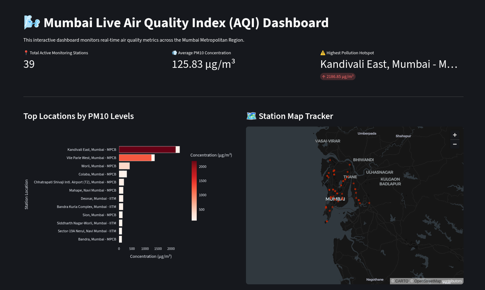
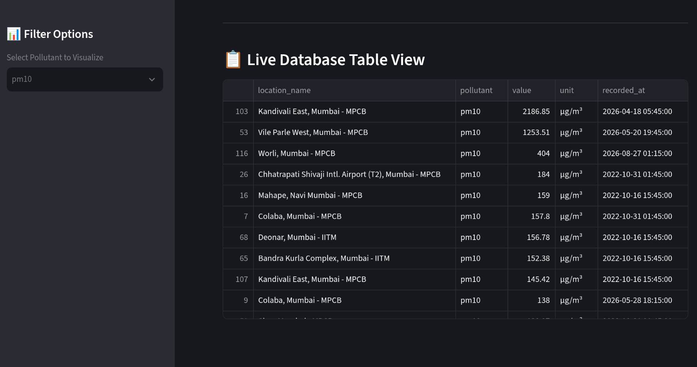

# Mumbai Live Air Quality Index (AQI) Data Pipeline & Dashboard

An end-to-end data engineering and analytics pipeline that extracts live air quality metrics across the Mumbai Metropolitan Region from the **OpenAQ v3 API**, stores the data in a local **PostgreSQL** database via secure Unix Sockets, and delivers a fully interactive, map-enabled web dashboard using **Streamlit** and **Plotly**.


## 🚀 System Architecture
```text
[OpenAQ v3 API] ➔ [Python Ingestion Script] ➔ [Unix Socket (Peer Auth)] ➔ [PostgreSQL Database] ➔ [Streamlit Dashboard (Dual-Mode DB/CSV)] ➔ [Interactive Map & Plotly Charts]
```

## 📸 Dashboard Preview
Here is a look at the interactive system in action:

### Geospatial Mapping & Metrics Tracker


### Pollution Hotspot Analysis


## 🛠️ Tech Stack
- **Data Pipeline:** Python 3.12 (Requests, Psycopg2, Pandas)
- **Database:** PostgreSQL (configured with secure Local Unix Sockets)
- **Web Dashboard:** Streamlit, Plotly Express
- **Operating System:** Fedora Linux

---

## 🏃 Setup & Installation

### 1. Database Setup
```bash
createdb aqi_project
psql -d aqi_project -c "
CREATE TABLE readings (
    id SERIAL PRIMARY KEY,
    location_name VARCHAR(255),
    latitude DOUBLE PRECISION,
    longitude DOUBLE PRECISION,
    pollutant VARCHAR(50),
    value DOUBLE PRECISION,
    unit VARCHAR(50),
    recorded_at TIMESTAMP
);"
```

### 2. Install & Ingest Data
```bash
pip install -r requirements.txt
python scripts/extract_aqi.py
python scripts/export_to_csv.py
```

### 3. Run Web Dashboard Locally
```bash
streamlit run app.py
```
